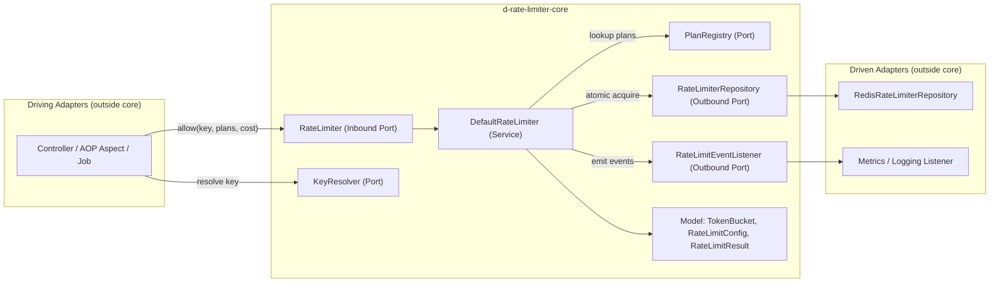
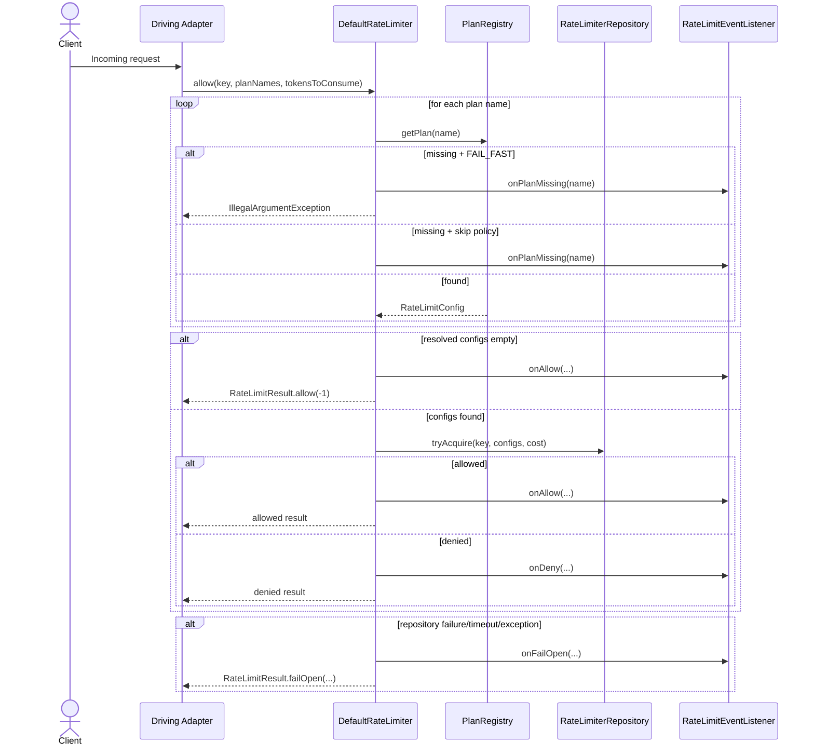

# d-rate-limiter-core: Detailed Module Guide

This document is the implementation guide for the `d-rate-limiter-core` module.  
It explains exactly what each file does, how the pieces connect, and what runtime flow is expected.

## 1. Module Purpose

`d-rate-limiter-core` is the domain engine of the project:

- It defines **rate-limiting behavior** (token bucket math + orchestration).
- It defines **ports** (interfaces) for integration points.
- It stays independent from Spring, Redis, and HTTP frameworks.

In short: this module decides **what should happen**, while other modules decide **how to connect to infrastructure**.

## 2. Package-Level Map

| Package | Responsibility |
|---|---|
| `core.model` | Immutable domain data and token consumption math. |
| `core.port` | Inbound and outbound contracts (Hexagonal ports). |
| `core.service` | Main orchestrator (`DefaultRateLimiter`). |
| `core.support` | Reusable default implementations/utilities. |
| `core.exception` | Domain-level exception used by adapters. |

## 3. Architecture Diagram (Core-Centric)

## 4. Request Flow Diagram (`allow`)

## 5. Production Files: What Each One Is For

### 5.1 `core.port` (Contracts)

| File | Primary Role | Key Responsibility |
|---|---|---|
| `d-rate-limiter-core/src/main/java/com/lokesh/ratelimiter/core/port/RateLimiter.java` | Inbound port | Defines `allow(...)` as the core API entry point. |
| `d-rate-limiter-core/src/main/java/com/lokesh/ratelimiter/core/port/RateLimiterRepository.java` | Outbound port | Defines atomic token acquire contract and state lookup contract for storage adapters. |
| `d-rate-limiter-core/src/main/java/com/lokesh/ratelimiter/core/port/PlanRegistry.java` | Outbound/integration port | Resolves plan names into `RateLimitConfig`. |
| `d-rate-limiter-core/src/main/java/com/lokesh/ratelimiter/core/port/KeyResolver.java` | Integration strategy port | Resolves a unique identity key from abstract request metadata. |
| `d-rate-limiter-core/src/main/java/com/lokesh/ratelimiter/core/port/RequestSource.java` | Request abstraction port | Provides request metadata (`remoteAddress`, `header`, `principal`) without framework coupling. |
| `d-rate-limiter-core/src/main/java/com/lokesh/ratelimiter/core/port/RateLimitEventListener.java` | Observability extension port | Emits allow/deny/fail-open/missing-plan events to metrics/logging adapters. |

### 5.2 `core.model` (Domain Data + Math)

| File | Primary Role | Key Responsibility |
|---|---|---|
| `d-rate-limiter-core/src/main/java/com/lokesh/ratelimiter/core/model/RateLimitConfig.java` | Policy entity | Immutable plan definition (`planName`, `capacity`, `tokensPerSecond`) with fail-fast validation. |
| `d-rate-limiter-core/src/main/java/com/lokesh/ratelimiter/core/model/TokenBucket.java` | State + algorithm | Implements refill + consume logic and wait-time calculation. |
| `d-rate-limiter-core/src/main/java/com/lokesh/ratelimiter/core/model/ConsumptionResult.java` | Internal value object | Encapsulates token consumption outcome and updated bucket state. |
| `d-rate-limiter-core/src/main/java/com/lokesh/ratelimiter/core/model/RateLimitResult.java` | External outcome object | Returns API-facing verdict metadata (`allowed`, `remainingTokens`, `waitMillis`, `reason`). |

### 5.3 `core.service` (Orchestration)

| File | Primary Role | Key Responsibility |
|---|---|---|
| `d-rate-limiter-core/src/main/java/com/lokesh/ratelimiter/core/service/DefaultRateLimiter.java` | Core orchestrator | Resolves plans, calls repository atomically, applies missing-plan policy, emits events, and enforces fail-open on exceptions. |

### 5.4 `core.support` (Default Utilities)

| File | Primary Role | Key Responsibility |
|---|---|---|
| `d-rate-limiter-core/src/main/java/com/lokesh/ratelimiter/core/support/InMemoryPlanRegistry.java` | Simple registry implementation | Thread-safe in-memory `PlanRegistry` for tests/dev/static config. |
| `d-rate-limiter-core/src/main/java/com/lokesh/ratelimiter/core/support/HeaderKeyResolver.java` | Key resolver implementation | Resolves identity from a configured header; returns empty string if missing. |
| `d-rate-limiter-core/src/main/java/com/lokesh/ratelimiter/core/support/PrincipalKeyResolver.java` | Key resolver implementation | Resolves identity from principal; defaults to `"anonymous"`. |
| `d-rate-limiter-core/src/main/java/com/lokesh/ratelimiter/core/support/RateLimitKey.java` | Key-format utility | Builds canonical key format: `ratelimiter:{tenant}:{user}:{plan}`. |
| `d-rate-limiter-core/src/main/java/com/lokesh/ratelimiter/core/support/MissingPlanPolicy.java` | Security behavior enum | Controls behavior when a requested plan cannot be resolved. |

### 5.5 `core.exception`

| File | Primary Role | Key Responsibility |
|---|---|---|
| `d-rate-limiter-core/src/main/java/com/lokesh/ratelimiter/core/exception/RateLimitExceededException.java` | Domain exception for adapters | Carries key/plan details when a request is blocked (typically mapped to HTTP 429 by driving adapters). |

## 6. Test Files: What Behavior They Lock Down

| Test File | What It Verifies |
|---|---|
| `d-rate-limiter-core/src/test/java/com/lokesh/ratelimiter/core/model/RateLimitConfigTest.java` | Config validation and valid construction behavior. |
| `d-rate-limiter-core/src/test/java/com/lokesh/ratelimiter/core/model/TokenBucketTest.java` | Refill behavior, capacity capping, and backward-time handling. |
| `d-rate-limiter-core/src/test/java/com/lokesh/ratelimiter/core/model/TokenBucketPrecisionTest.java` | Floating-point drift remains within acceptable tolerance under many refill operations. |
| `d-rate-limiter-core/src/test/java/com/lokesh/ratelimiter/core/service/DefaultRateLimiterTest.java` | Missing-plan policy behavior, event dispatching, and fail-open behavior on repository failure. |
| `d-rate-limiter-core/src/test/java/com/lokesh/ratelimiter/core/support/InMemoryPlanRegistryTest.java` | Register/lookup/overwrite behavior in the in-memory registry. |
| `d-rate-limiter-core/src/test/java/com/lokesh/ratelimiter/core/support/HeaderKeyResolverTest.java` | Header-based key resolution behavior, including missing-header fallback. |
| `d-rate-limiter-core/src/test/java/com/lokesh/ratelimiter/core/support/PrincipalKeyResolverTest.java` | Principal-based key resolution and anonymous fallback behavior. |
| `d-rate-limiter-core/src/test/java/com/lokesh/ratelimiter/core/support/RateLimitKeyTest.java` | Standard key format and default substitutions for missing fields. |

## 7. Design Rules Maintainers Should Preserve

1. Keep `core` free of Spring/Redis/Servlet dependencies.
2. Add new integration points as **ports** first, then adapters in outer modules.
3. Keep token math in domain model (`TokenBucket`), not in adapters.
4. Preserve fail-open runtime behavior in `DefaultRateLimiter`.
5. Preserve atomic multi-plan semantics through `RateLimiterRepository.tryAcquire(...)`.

## 8. Where to Extend Next

- Add Redis adapter implementation in `d-rate-limiter-redis` for `RateLimiterRepository`.
- Add AOP/web driving adapter in `d-rate-limiter-spring-boot-starter`.
- Add sample app wiring in `d-rate-limiter-samples`.

