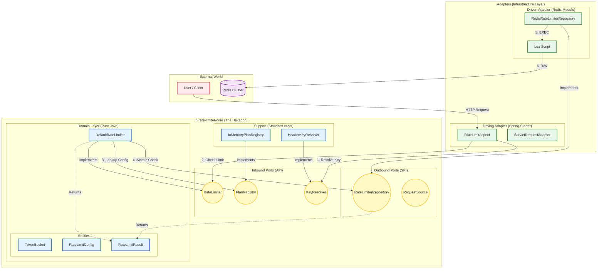
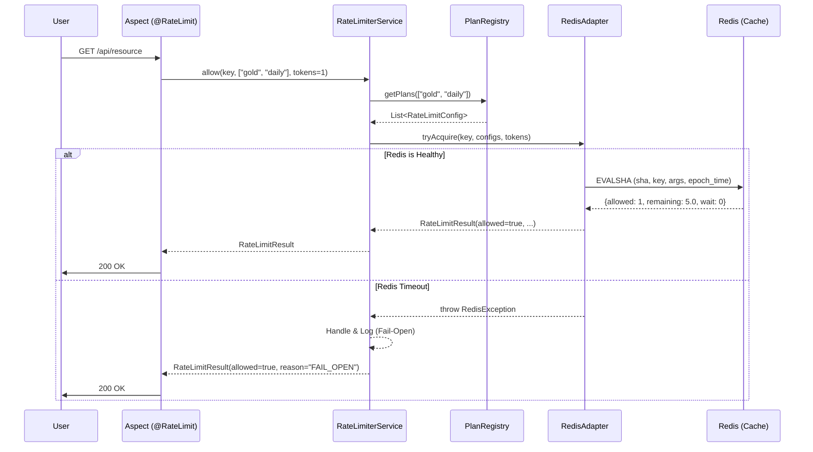
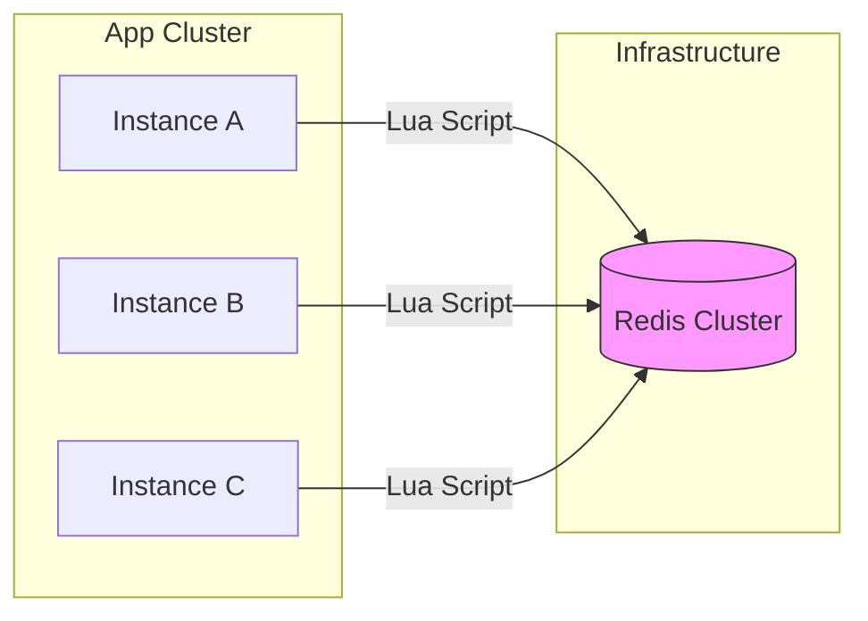

# Technical Design Document: d-rate-limiter

## 1. System Overview
**d-rate-limiter** is a distributed rate-limiting library for JVM applications. It acts as a middleware that intercepts requests, checks availability against a Token Bucket stored in Redis, and either allows the request to proceed or throws an exception.

### 1.1 Tech Stack
*   **Language**: Java 21
*   **Framework**: Spring Boot 4.0.2
*   **Storage**: Redis (Cluster or Sentinel compatible)
*   **Driver**: Lettuce (Non-blocking I/O)
*   **Format**: Custom Binary Serialization
*   **Build**: Maven Multi-Module

## 2. Architecture (Hexagonal / Ports & Adapters)

The system strictly adheres to the **Hexagonal Architecture**. This ensures that the core business logic (The "Domain") is completely isolated from external concerns like the Web Framework (Spring) or the Database (Redis).

### 2.1 The Hexagon (Detailed View)

This diagram illustrates the separation between the **Core Domain** (Blue), the **Ports** (Yellow), and the **Infrastructure Adapters** (Green).



### 2.2 Key Architectural Components

| Component | Layer | Responsibility |
| :--- | :--- | :--- |
| **`RateLimiter` (Port)** | Core (Inbound) | The primary API. Defines *what* the system does (allow/deny). |
| **`DefaultRateLimiter`** | Core (Service) | The "Brain". Orchestrates plan lookup, validation, and fail-open logic. |
| **`TokenBucket`** | Core (Model) | The "Math". Defines the refill algorithm. Pure, immutable, and side-effect free. |
| **`RateLimiterRepository`** | Core (Outbound) | The "Socket". Defines persistence needs. Does not know *how* data is stored. |
| **`RedisRateLimiterRepository`** | Infra (Adapter) | The "Plug". Implements the repository using Redis and Lua. |
| **`RateLimitAspect`** | Infra (Adapter) | The "Driver". Intercepts HTTP requests and drives the Core. |

### 2.3 Detailed Request Flow (Sequence)


### 2.3 Deployment Diagram (Physical View)


### 2.1 Modules
1.  **`d-rate-limiter-core`**:
    *   **Responsibility**: Defines the `TokenBucket` logic and `RateLimiter` interfaces.
    *   **Dependencies**: None (Pure Java).
2.  **`d-rate-limiter-redis`**:
    *   **Responsibility**: Implements `RateLimiterRepository` using Spring Data Redis. Handles Lua scripting, Binary serialization, and connection pooling.
    *   **Dependencies**: `spring-boot-starter-data-redis`.
3.  **`d-rate-limiter-spring-boot-starter`**:
    *   **Responsibility**: Auto-configuration. Detects `application.yml`, registers Beans, and applies the AOP Aspect.
    *   **Dependencies**: `core`, `redis`, `spring-boot-starter-aop`.

## 3. Data Flow (Request Lifecycle)

1.  **Intercept**: Request hits a method annotated with `@RateLimit(key = "user", plan = "gold", tokens = 1)`.
2.  **Resolve**:
    *   `KeyResolver` extracts the user ID (e.g., `user:123`).
    *   `PlanRegistry` looks up "gold" config (Capacity: 10, Refill: 1/sec).
    *   **Weight**: The cost of the request (default 1) is identified.
3.  **Execute**:
    *   The `RateLimiterService` calls `repository.allow("user:123", rules, 1)`.
    *   Note: For **Chained Limits**, a list of rules is passed to ensure atomicity.
4.  **Redis Logic (Lua)**:
    *   **Get** current `tokens` and `last_refill` from Hash.
    *   **Time Source**: Get current Server Time (`redis.call('TIME')`) to prevent clock skew.
    *   **Calculate** refill: `delta = (now - last_refill) * rate`.
    *   **Update** tokens: `new_tokens = min(capacity, old_tokens + delta)`.
    *   **Check**: If `new_tokens >= tokens_to_consume`, decrement and return `true`. Else, return `false`.
    *   **Save**: `HSET key ...` (with TTL).
5.  **Result**:
    *   **True**: Method executes.
    *   **False**: Throw `RateLimitExceededException`.

## 4. Data Schema (Redis)

### Key Structure
`rate_limiter:{plan_name}:{resolved_key}`
Example: `rate_limiter:gold:user_123`

### Value Structure (Hash)
| Field | Type | Description |
| :--- | :--- | :--- |
| `t` | Binary (8 bytes) | Current Tokens (Double). |
| `ts` | Binary (8 bytes) | Last Refill Timestamp (Long, milliseconds/nanoseconds). |
| `v` | Integer | Schema Version (Currently `1`). |

*TTL is set to `Capacity / Rate` seconds (bucket lifetime).*

## 5. Class Design (Core)

```java
public interface RateLimiter {
    /** Orchestrates plan lookup and repository execution */
    RateLimitResult allow(String key, List<String> planNames, int tokens);
}

public record RateLimitConfig(
    String planName,
    long capacity,
    double tokensPerSecond
) {}

public record RateLimitResult(
    boolean allowed,
    double remainingTokens,
    long nanosToWait,
    String reason
) {}

public interface KeyResolver {
    String resolve(RequestSource source);
}
```

### 5.1 Provided Strategies (Core)
The library provides several out-of-the-box implementations in the Core module:
*   **`InMemoryPlanRegistry`**: Simple concurrent-map-based registry for testing or static rules.
*   **`HeaderKeyResolver`**: Extracts rate-limit identity from a specific HTTP header (e.g., `X-API-KEY`).
*   **`PrincipalKeyResolver`**: Uses the authenticated user's name as the rate-limit identity.

## 6. Resilience & Safety
*   **Fail Open**: If `EVALSHA` throws a `RedisConnectionException`, the library logs an error and returns `true` (Allowed).
*   **Self-Healing**: If `EVALSHA` throws `NOSCRIPT`, the library catches it, calls `SCRIPT LOAD`, and retries immediately.
